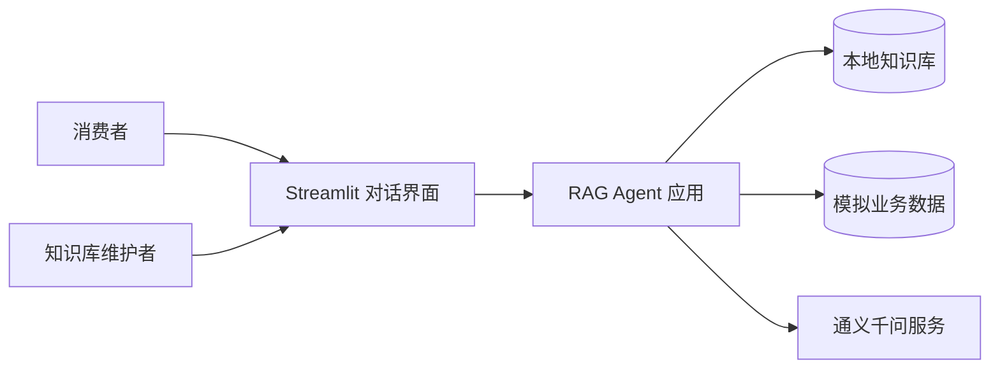
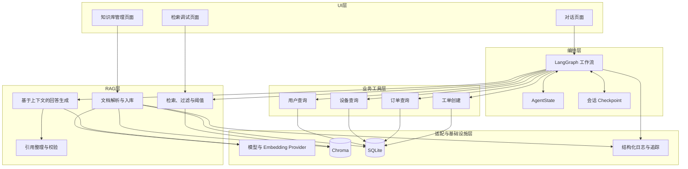
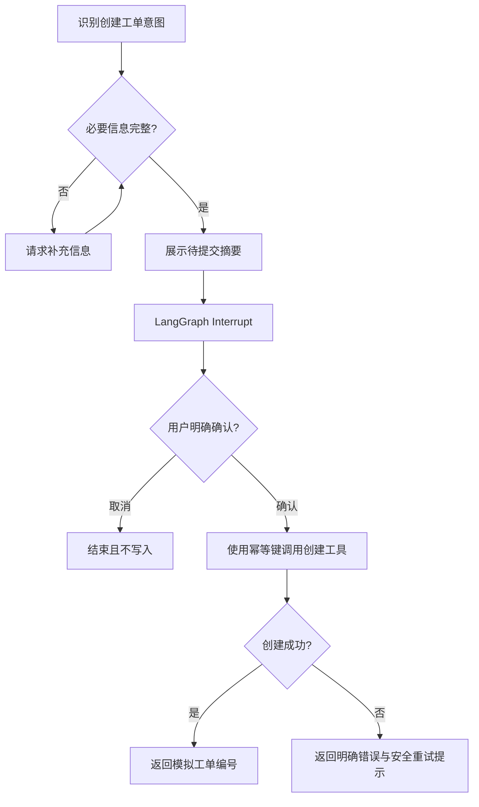

# 企业售后知识库 RAG 智能体：基线架构

## 1. 架构目标

本架构服务于扫地机器人售后知识问答、模拟设备与订单查询、人工确认后创建模拟工单三类流程。设计重点是让数据来源、Agent 决策和写操作都可解释、可测试、可恢复。

阶段 0 只冻结模块边界和数据流，不代表对应组件已经实现。

## 2. 系统上下文



外部参与者与系统边界：

- 消费者通过对话提出知识问题、查询设备或申请工单。
- 知识库维护者管理有权使用的售后资料。
- 通义千问是外部模型服务，必须经过 Provider 适配层访问。
- 用户、设备、订单和工单服务在第一版中均为本地模拟实现。

## 3. 逻辑组件



## 4. 组件职责

| 组件 | 主要职责 | 不承担的职责 |
|---|---|---|
| Streamlit UI | 接收输入、展示流式回答、引用、工具状态和错误 | 不保存核心业务规则，不决定是否允许写操作 |
| LangGraph | 保存状态、路由、循环、确认中断和恢复 | 不负责文档解析或向量计算细节 |
| LangChain | Loader、Splitter、模型、Embedding、Retriever、Prompt 和解析器 | 不隐式控制必须确定执行的业务顺序 |
| Ingestion | 解析、清洗、分片、版本管理和增量入库 | 不回答用户问题 |
| Retrieval | Top-K、元数据过滤、阈值与后续重排 | 不自行生成事实答案 |
| Generation | 依据编号上下文生成结构化答案 | 不访问未经路由允许的业务工具 |
| Citation | 检查引用是否真实对应已检索分片 | 不为模型补造来源 |
| Tools | 以结构化契约查询或修改模拟业务数据 | 不自行决定用户意图或绕过确认 |
| Provider | 隔离通义千问及未来其他模型实现 | 不包含售后业务逻辑 |
| Chroma | 保存和检索文本向量 | 不保存完整业务事务状态 |
| SQLite | 保存文档版本、导入任务、Checkpoint 或模拟业务记录 | 不承担语义向量检索 |
| Observability | 记录脱敏日志、耗时、Token、路由和错误 | 不记录密钥或不必要的个人数据 |

## 5. 核心数据流

### 5.1 知识入库

```text
原始文档
  -> 文件类型与权限检查
  -> 解析
  -> 文本规范化
  -> 分片与元数据
  -> Embedding
  -> Chroma 幂等写入
  -> SQLite 更新文档版本和任务状态
```

关键约束：

- 每个文档和分片使用稳定 ID。
- 分片保留文档、页码、标题、序号和字符范围。
- 单个文件失败只影响该文件，并留下明确状态。
- 新增、修改、删除资料后，SQLite 与 Chroma 必须保持可验证的一致性。

### 5.2 普通知识问答

```text
用户问题
  -> 意图路由
  -> 查询规范化
  -> Top-K 检索与过滤
  -> 可靠性阈值
     -> 不可靠：拒答或请求补充信息
     -> 可靠：编号上下文 -> 模型生成 -> 引用校验 -> 回答
```

关键约束：

- 模型只依据传入上下文回答知识事实。
- 引用只能指向本次实际命中的分片。
- 低相关结果不能为了“总有答案”而进入生成流程。

### 5.3 设备或订单查询

```text
用户问题
  -> 意图路由
  -> 必要字段检查
     -> 缺失：请求补充
     -> 完整：调用只读业务工具
  -> 校验结构化结果
  -> 汇总回答并标记模拟数据来源
```

关键约束：

- 不随机补全用户、设备或订单信息。
- 工具错误与正常业务结果使用不同类型表达。
- 只允许访问当前用户被授权的数据。

### 5.4 创建售后工单



关键约束：

- 确认是图中的强制节点，模型不能跳过。
- 沉默、含糊回答或新问题不等于确认。
- 重试复用幂等键，避免重复工单。

## 6. 核心领域对象

| 对象 | 关键字段示例 |
|---|---|
| SourceDocument | document_id、source、file_type、checksum、version、status |
| DocumentChunk | chunk_id、document_id、content、page、heading、index、char_range |
| RetrievalHit | chunk、score、rank、filter、retrieval_run_id |
| Citation | citation_id、chunk_id、source、page、excerpt |
| AgentState | messages、intent、user_context、retrieval_hits、tool_result、pending_action、error |
| ToolResult | status、data、error_code、retryable、request_id |
| TicketDraft | user_id、device_id、issue、contact、summary |
| Confirmation | action_id、summary_hash、decision、confirmed_at |

字段将在对应实现阶段用 Pydantic 模型正式定义；本表只冻结语义边界。

## 7. 状态与存储边界

- Chroma：仅保存文本分片的向量、检索所需内容及元数据。
- SQLite 文档域：保存原文档、版本、校验值、导入任务和错误状态。
- SQLite 业务域：保存可预测的模拟用户、设备、订单和工单数据。
- Checkpoint：保存按 `thread_id` 隔离的 Agent 执行状态，包括完整消息历史与暂停位置；默认与元数据、业务数据共用 `data/rag_agent.sqlite3`，但使用独立的表和独立连接。
- 会话归属：`_threads` 表记录 `thread_id → user_id`。LangGraph 视 `thread_id` 为不透明字符串，因此「这条会话属于谁」属于本系统的应用状态，由代码而非 Checkpoint 判定。
- 长期偏好：`user_preferences` 表按 `user_id` 保存，与消息历史分离，清除会话不影响偏好。
- Streamlit session state：只保存界面临时状态，不能作为唯一业务状态或确认依据。
- 文件系统：保存原始文档、可选清洗结果、评测集和本地持久化数据。

记忆分层：

```text
本轮输入 ──┐
           ├─> Prompt 窗口（最近 8 条，可配） ──> 模型
长期偏好 ──┘
           └─ 完整消息历史 ──> Checkpoint（不随窗口裁剪）
```

## 7.1 界面层的位置

```text
Streamlit 页面（streamlit run src/rag_agent/ui/app.py）
   │  只做：展示、收集输入、触发动作
   v
既有入口（chat_turn / stream_chat_turn / ingest_path / sync_index / remove_document）
   v
业务规则与副作用（agent/、tools/、memory/、ingestion/）
```

界面不实现任何业务规则：意图路由、确认门禁、幂等键与引用校验全部留在原有模块，因此 CLI 与界面走的是同一套规则，界面无法绕过写操作门禁。

界面状态分两层，且必须在界面上区分：

| 层 | 存放位置 | 生命周期 |
|---|---|---|
| 界面显示的消息列表 | `st.session_state` | 当前浏览器会话；刷新即丢 |
| 会话真实状态 | SQLite Checkpoint（按 `thread_id`） | 跨刷新、跨进程重启 |

进程级共享对象（向量库、模型客户端、SQLite 句柄、检索器）由 `@st.cache_resource` 持有，不放在 `st.session_state`，也不放在模块级可变变量里。

## 8. 信任边界与安全控制

```text
不可信：用户输入、上传文件、文档正文、模型输出、工具返回
                          |
                          v
可信控制：Schema 校验、路由规则、权限检查、确认节点、引用校验
                          |
                          v
受控副作用：索引更新、Checkpoint 写入、模拟工单创建
```

基本规则：

- 文档中的命令只是内容，不是系统指令。
- 模型输出必须经过 Schema 和业务规则校验。
- 工具只暴露完成场景所需的最小权限。
- 写工具只能由已确认、可追踪的待执行动作触发。
- 日志按字段脱敏，并避免保存完整模型上下文。

## 9. 失败与降级路径

| 故障点 | 降级行为 |
|---|---|
| 文档解析失败 | 标记单文件失败，继续处理其他文件 |
| Embedding 服务失败 | 不提交不完整索引，记录可重试任务 |
| Chroma 不可用 | 停止知识回答生成并说明检索不可用 |
| 聊天模型不可用 | 保留已检索来源，返回模型服务错误 |
| 业务查询工具失败 | 不推断业务状态，返回分类错误 |
| 工单工具结果不确定 | 使用相同幂等键查询或重试，不重复创建 |
| Checkpoint 失败 | 不执行需要恢复保证的写操作 |
| 引用校验失败 | 拒绝输出未验证引用，进入安全错误分支 |

## 10. 计划中的代码映射

```text
src/rag_agent/
├── config/          配置与 Provider 组装
├── domain/          领域模型与错误类型
├── ingestion/       入库数据流
├── retrieval/       检索与可靠性判断
├── generation/      回答与引用
├── tools/           模拟业务工具
├── agent/           LangGraph 状态和工作流
├── memory/          Checkpoint 与会话
├── evaluation/      数据集、指标与报告
├── observability/   日志、耗时和追踪
└── ui/              Streamlit 页面
```

该目录映射将在阶段 1 创建工程骨架时落地。

## 11. 架构验收问题与参考答案

以下问题与参考答案用于学习和查阅，不要求学习者提交口头或书面作答；阶段验收以实际运行和测试证据为主。

### 问题 1：知识文档如何从文件变成可以检索的分片？

**参考答案：** 系统先检查文件类型和基本权限，再用对应 Loader 解析文本；随后进行编码与文本规范化，按标题和递归字符规则切分，并为每个分片保存父文档 ID、页码、标题、序号和字符范围。分片通过 Embedding 模型转成向量，用稳定 chunk ID 幂等写入 Chroma，同时在 SQLite 记录文档版本和入库任务状态。这样检索结果既能按语义命中，也能追溯到原始资料。

### 问题 2：为什么 Chroma 与 SQLite 承担不同职责？

**参考答案：** Chroma 擅长保存向量并进行语义相似度检索，用来回答“哪些文本与当前问题最相关”；SQLite 擅长事务、唯一约束和结构化查询，用来保存文档版本、导入任务、模拟用户、设备、订单和工单等记录。两者的数据模型和查询目标不同，不能为了少用一个组件而把所有数据塞进向量库。项目后续还必须验证两种存储之间的更新一致性。

### 问题 3：普通知识问答为什么需要低置信度分支和引用校验？

**参考答案：** Top-K 总能返回若干候选，但候选不一定真正相关。低置信度分支阻止系统把无关分片交给模型后强行作答；引用校验则确保答案中的编号只指向本次实际命中的分片，防止模型编造来源。二者分别控制“是否应当回答”和“回答依据是否真实存在”，共同降低幻觉风险。

### 问题 4：为什么工单确认必须是 LangGraph 的确定性节点？

**参考答案：** Prompt 和模型输出具有概率性，不能证明模型每次都会遵守“先确认再写入”。把摘要展示、Interrupt、确认判断和创建工具写成固定节点与条件边后，未明确确认的状态没有通往写工具的合法路径。这样可以通过自动化测试证明用户取消、沉默或含糊回答时都不会创建工单。

### 问题 5：Streamlit session state 为什么不能代替 Agent Checkpoint？

**参考答案：** Streamlit session state 主要服务当前界面的 rerun 和临时交互，可能随浏览器会话或服务重启丢失，也不能单独提供可靠的工作流恢复和用户隔离。Agent Checkpoint 按 thread_id 保存图的执行状态和暂停位置，使系统能在重启或等待人工确认后从正确节点继续。界面状态负责显示，Checkpoint 才负责工作流连续性。

### 问题 6：模型、向量库或业务工具失败时，系统分别如何降级？

**参考答案：** 聊天模型失败时，系统返回模型服务错误，不伪造答案；向量库失败时，系统停止基于知识库的生成，因为此时没有可靠上下文；只读业务工具失败时，系统返回明确的分类错误，不猜测设备或订单状态；创建工单结果不确定时，系统复用同一幂等键查询或安全重试，不能直接再次创建。不同依赖失败必须保留不同错误语义。

### 问题 7：哪些数据是真实资料，哪些功能属于模拟实现？

**参考答案：** 用户有权使用的说明书、维修手册、FAQ 和售后规范可以作为真实知识资料，并保留来源、版本或校验值。用户身份、联系方式、设备状态、订单信息、工单编号，以及查询或创建这些记录的 Repository/API 都属于本地模拟实现。README、演示界面和简历必须明确标注这一边界，不能描述成真实企业接口或实时数据。
